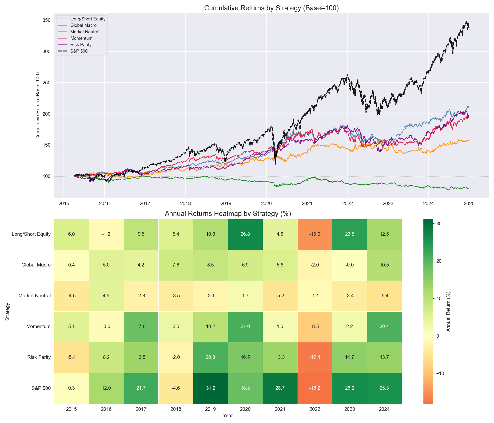
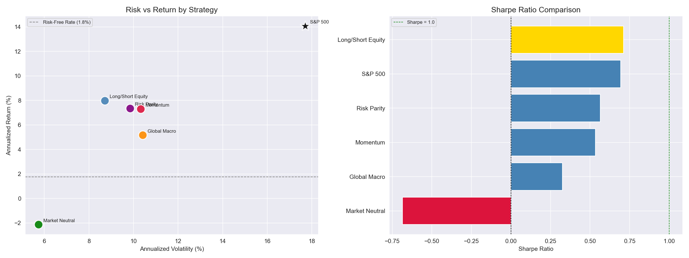
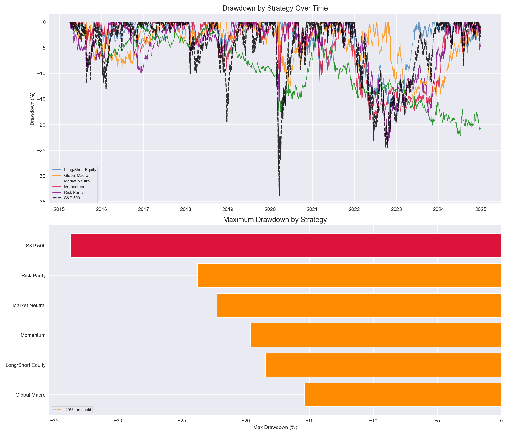
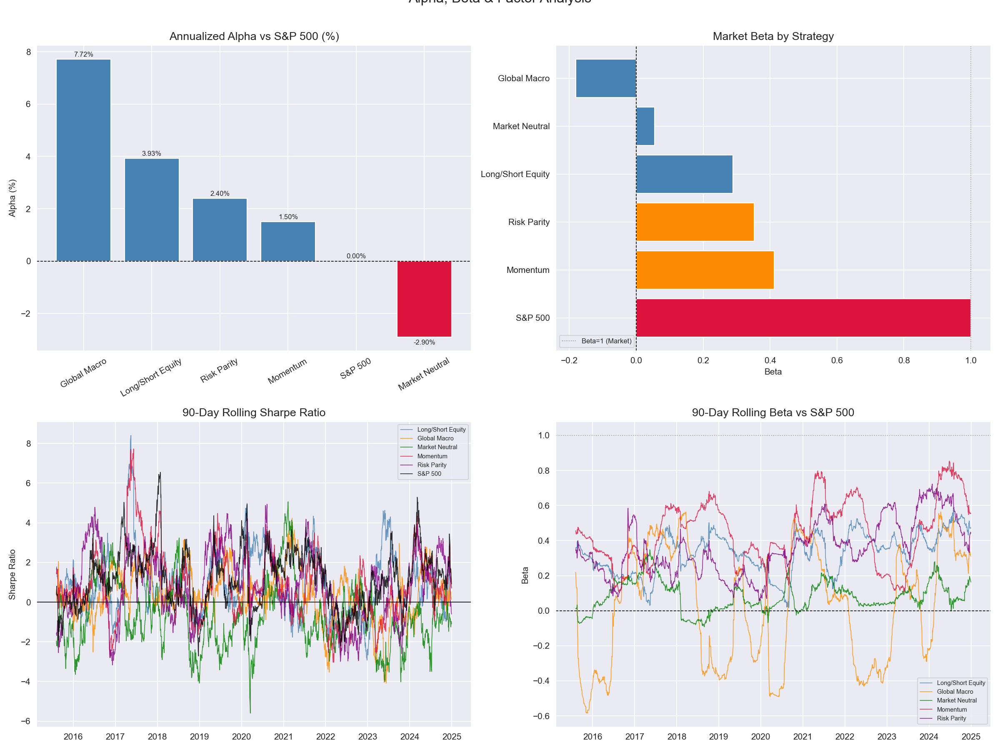
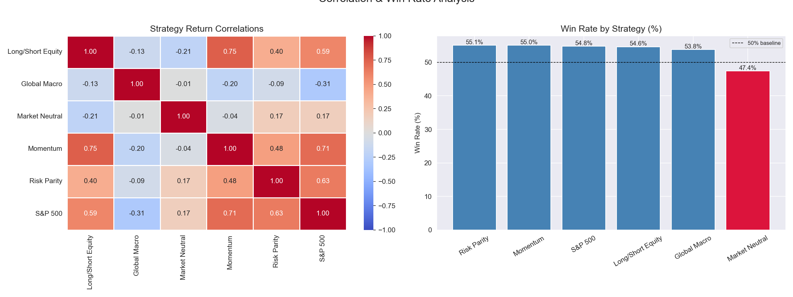

# Hedge Fund Performance Analysis — Returns, Alpha, Beta & Factor Exposure

A Python analysis of five simulated hedge fund strategies (Long/Short Equity, Global Macro, Market Neutral, Momentum, and Risk Parity) benchmarked against the S&P 500 over a 10-year period (2015–2024), computing institutional-grade performance metrics including alpha, beta, Sharpe ratio, Sortino ratio, Calmar ratio, maximum drawdown, Value at Risk, and Conditional VaR.

---

## Problem Statement
Evaluating hedge fund performance requires going beyond simple return comparison to analyze risk-adjusted returns, market sensitivity, drawdown resilience, and factor exposure — the toolkit used by institutional allocators when selecting fund managers. This project simulates five distinct hedge fund strategies using real ETF market data to answer:
- Which strategy generates the best risk-adjusted returns?
- Which strategies successfully produce positive alpha?
- How does each strategy behave during market stress periods?
- Which strategies provide genuine portfolio diversification?

---

## Strategies Analyzed

| Strategy          | Construction                                    | Philosophy             |
|-------------------|-------------------------------------------------|------------------------|
| Long/Short Equity | Long QQQ (growth), Short VLUE (value)           | Factor spread          |
| Global Macro      | 60-day momentum signal across SPY, TLT, GLD, EEM| Trend following        |
| Market Neutral    | Long IWM (small cap), Short SPY (large cap)     | Size factor spread     |
| Momentum          | Long MTUM, Short VLUE                           | Momentum premium       |
| Risk Parity       | Inverse volatility weighted SPY/TLT/GLD/VNQ     | Equal risk contribution|

---

## Data Source
- **Provider:** Yahoo Finance via `yfinance` Python library
- **Universe:** 16 ETFs across equities, fixed income, commodities, and factor strategies
- **Period:** January 2015 – December 2024
- **Risk-Free Rate:** 13-week T-bill (^IRX)
- No CSV download required — all data pulls via API

---

## Tools & Libraries
- Python 3.x
- Pandas, NumPy
- Matplotlib, Seaborn
- yfinance
- SciPy (linear regression for alpha/beta)

---

## Performance Metrics Computed
- Annualized return and volatility
- Sharpe ratio (excess return / volatility)
- Sortino ratio (excess return / downside deviation)
- Calmar ratio (annualized return / max drawdown)
- Maximum drawdown (peak-to-trough)
- Alpha and Beta vs S&P 500 (OLS regression)
- R-Squared (market explanation of returns)
- Win rate (% of positive return days)
- Value at Risk — VaR 95% (daily)
- Conditional VaR — CVaR 95% (Expected Shortfall)
- Rolling 90-day Sharpe ratio
- Rolling 90-day Beta

---

## Key Findings
- **Long/Short Equity achieved the highest Sharpe ratio (0.71)** — marginally outperforming the S&P 500 (0.69) at less than half the volatility (8.71% vs 17.70%), delivering the core hedge fund value proposition of superior risk-adjusted returns with lower drawdown (-18.46% vs -33.72%)
- **Global Macro generated the highest alpha (+7.72% annualized)** with near-zero market correlation (-0.31) and negative beta (-0.181), making it the most valuable portfolio diversifier despite its lower absolute return (5.17%)
- **The S&P 500 won on raw return (14.07%)** — none of the hedge strategies matched it on absolute terms during one of the strongest U.S. equity decades in history, validating the passive investing challenge for active managers
- **Market Neutral failed its core mandate** — delivering -2.13% annualized return due to structural short exposure against large-cap tech, the strongest-performing equity segment of the decade, despite achieving near-zero beta (0.054)
- **S&P 500 CVaR of -2.74% daily** is more than double Long/Short Equity's -1.29% — confirming hedge strategies provide significantly better tail risk protection for institutional allocators
- **All positive-return strategies achieved 53-55% win rates** — confirming that even well-constructed active strategies win only slightly more than half the time
- **Global Macro's R-squared of 0.095** confirms its returns are 90.5% unexplained by equity market movement — the highest diversification purity and primary justification for multi-asset institutional portfolio inclusion
- **Momentum's 0.71 S&P 500 correlation** is the highest among hedge strategies, limiting diversification benefit and explaining its vulnerability to sharp market reversals

---

## Visualizations

### Cumulative Returns & Annual Heatmap

### Risk vs Return & Sharpe Ratio

### Drawdown Analysis

### Alpha, Beta & Factor Exposure

### Correlation & Win Rate

---

## Limitations & Next Steps
- Strategies simulated using ETF proxies — real hedge funds use leverage, derivatives, and proprietary signals not captured here
- No transaction costs, slippage, or management fees applied — real returns after 2-and-20 fee structures would be materially lower
- Fixed strategy weights — real funds dynamically adjust exposure based on market conditions
- 2015–2024 dominated by U.S. large-cap tech outperformance — results differ across regimes
- Future work: Fama-French 5-factor regression, leverage analysis, transaction cost modeling, fund-of-funds portfolio optimization, dynamic position sizing

---

## How to Run This Project
1. Clone the repository
2. Install Python dependencies: `pip install pandas numpy matplotlib seaborn yfinance scipy`
3. Open `hedge_fund_analysis.ipynb` in Jupyter or VS Code
4. Run all cells — all data pulls automatically from Yahoo Finance API

---

## Repository Structure

---

## Author
**Mihrimah Qozat**
[LinkedIn](https://linkedin.com/in/mihrimah-qozat) |
[GitHub](https://github.com/mihrimahqozat)
